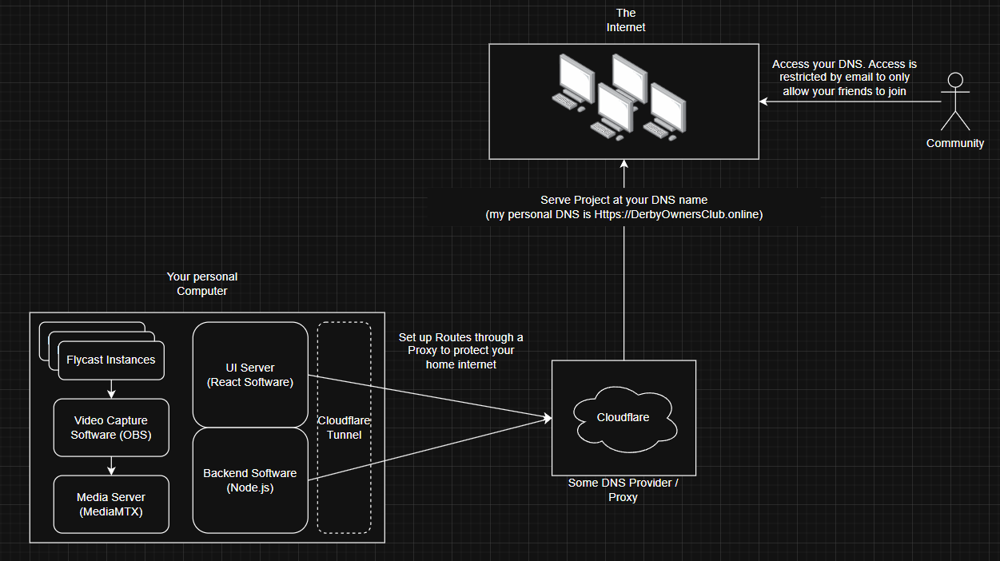

# Derby Owners Club Self Hosting
Welcome to Derby Owners Club self hosting. I made this tool mainly to play with my friends/family when JohnReevesiii put out the original ROM of the game. 

What is it? I made this small diagram to briefly explain everything that is happening. Only took about 10 minutes to make, so it is not all encomposing.

I will go from left to right explaining each bit. Be warned you will need at least a little technical no how to follow along most likely. I also will have to make a lot more docs on how to run things from scratch.

## 1. Flycast Instances
This is the actual game running on your machine. We need the game played somewhere to have someone actually interact with it.

## 2. Video Capture Software (OBS)
OBS is a software that captures Video, and encodes it into a machine readable format. OBS also will be able to connect via Whip to a media Server to host this video stream. The entire reason this is important, is that a Web Browser needs a way to understand and display video. The way that works is using something called WebRTC. 

## 3. Media Server (MediaMTX)
This handles and creates a server to serve the data from the Video Capture software so that another entity can read it. Every screen will get its own path to visit, like Localhost:8889/satellite1.

## 4. UI Server (React software)
React is a framework for building Web UI projects. This is software I made (basically all AI for free I just made it all work in the end). This will build the UI you see and host it at some port for viewing. It is a pretty simple project, just some displays for the video as well as some reservation tools, and UI buttons for interacting with the game.

## 5. Backend Software (Node.js Project)
This is a simple backend server that will create Xbox controllers on your machine, one for each satellite. It will also handle all the inputs from the browser to map the controls to each flycast instance. This also handles the Email enforcement to only allow your friends to get past the login screen. This is important, as you are exposing your personal computer to the internet. You really only want people you trust using it. Also your own hardware is not infinite, so you cant support the entire community yourself. There are ways to eventually get there, but I havent built that yet.

## 6. CloudFlare Tunnel
This is a small tool that will allow your machine to map ports from your computer, to allow Cloudflare to communicate with your machine.

## 7. Some DNS Provider Proxy (Cloudflare)
Cloudflare is a very simple way to protect your computer from the internet. It will be the thing that is actually exposed to the internet. Any traffic to cloudflare can then be sent to your computer, so that your computer is only touched by cloudflare, and not the dangerous internet

## 8. The Internet
The internet to me here is just any browser. If you visit your Host name, mine is https://derbyownersclub.online, you will now be able to access everything you have set up. 
- Live video feeds of the gameplay
- Ability to reserve a satellite
- Live input to a satellite for actually playing

## Things to set up
- In the backend, there is an env.example file you would have to fill in your own values for this
- In the frontend, there is an env.example file you would have to fill in your own values for this
- For both files you would remove the .example so that it becomes your real env configuration

# What is left to do?
- [ ] Horse Saving
- [ ] A lot of streamlining of setup
- [ ] Latency Improvements
  - [ ] Look into GStreamer to replace OBS
  - [ ] Look into ffmpeg to replace OBS
- [ ] Infrastructure to join home servers together 